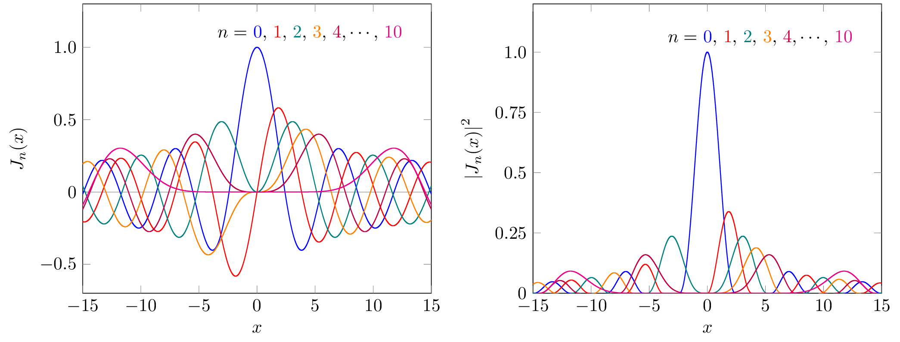

1次から5次くらいまでのベッセル関数をプロットしたくなりました．macでプロットするためにした作業をメモします．

まず，ベッセル関数の値を計算してファイルに出力する部分の環境整備については[こちらのGist](https://gist.github.com/KazuhisaMiyazawa/dec54412ff428806b232019a9ccd0a68)にまとめましたのでご覧ください．

本資料は，

1. C言語でベッセル関数の値をファイルに出力
2. TikZでそのファイルをプロット

したデータです．それぞれ`data`フォルダと`src`フォルダに必要なファイルがあります．具体的なコマンド等は各フォルダにあります`makefile`をご覧ください．

プロットまで正常にできますと，以下のようにベッセル関数をプロットした図が生成されます．

